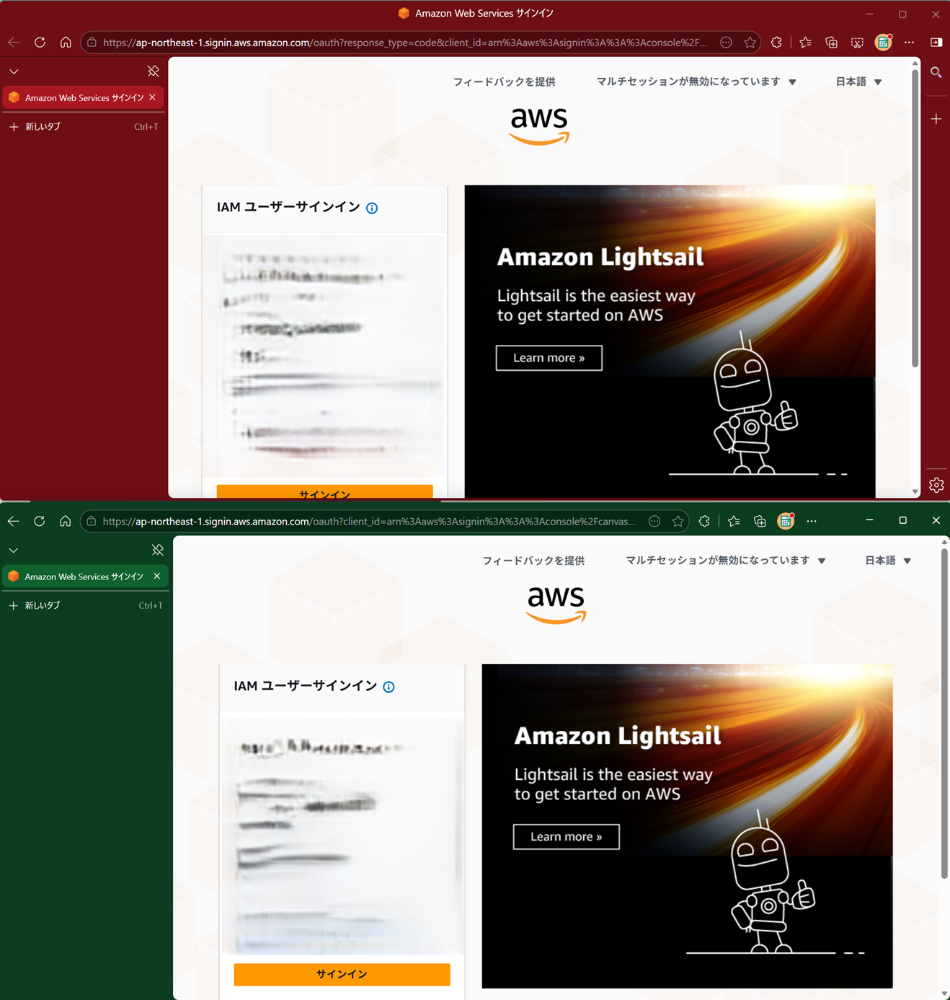
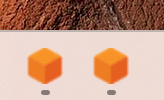
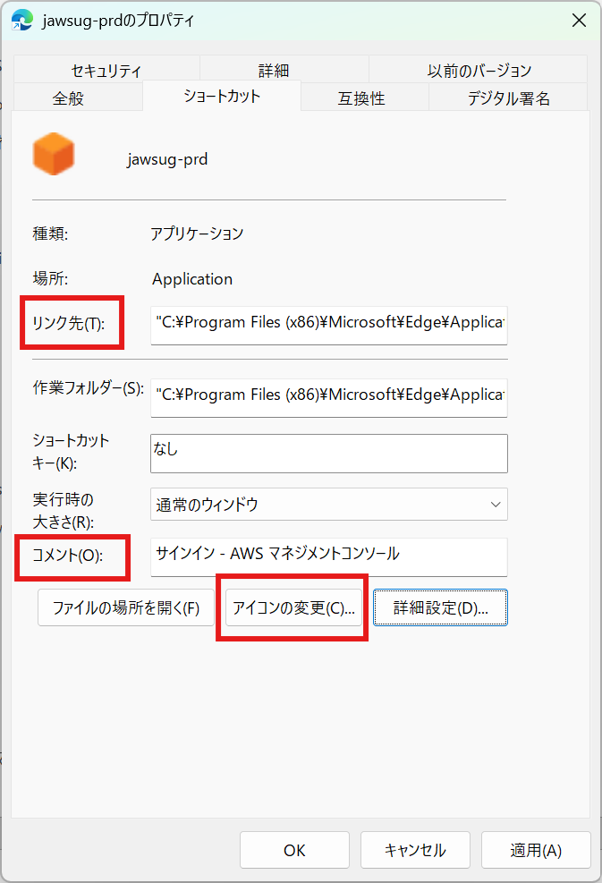
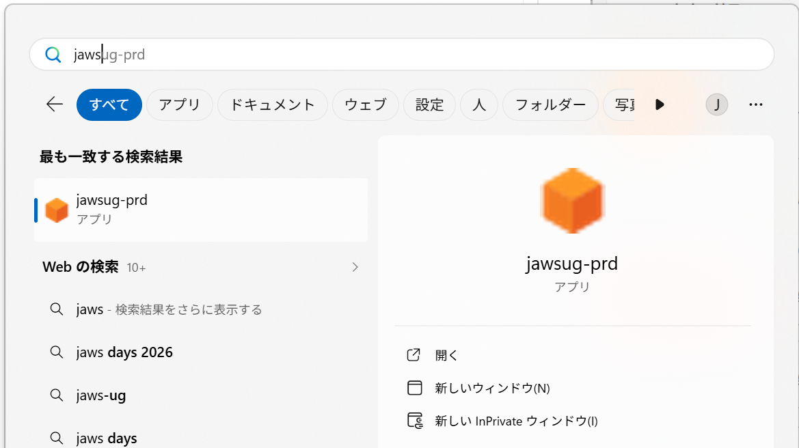
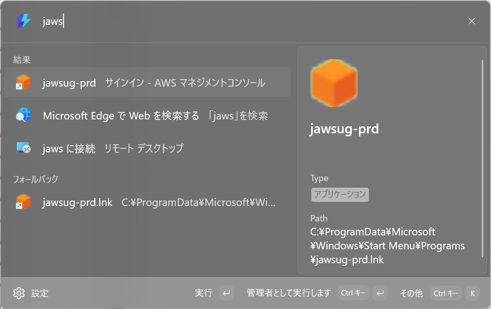
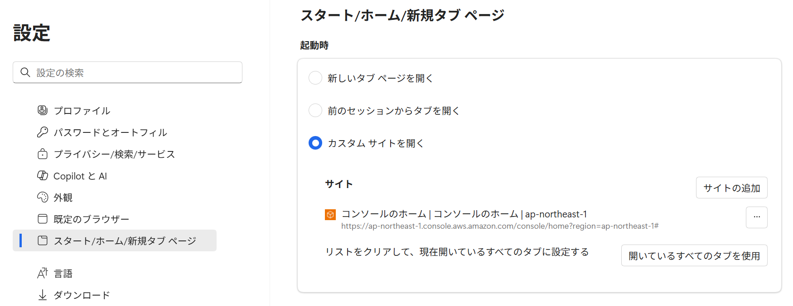
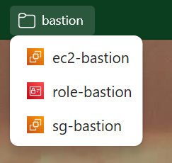
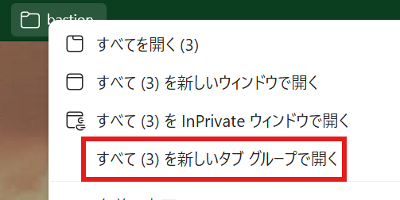
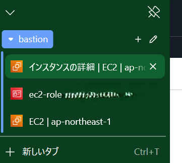

# EdgeプロファイルでAWSアカウントを安全に使い分ける

JAWS-UG 栃木 オフライン # 8 - 10分発表

---

# 発表者

- 橋本淳一
- フリーランスのクラウドエンジニア
- 最近都内から栃木に引っ越しました
- AWS歴8年くらい
- 現在の仕事はECサイトのインフラ運用
- ポートフォリオ: https://lapras.com/public/jhashimoto

---

# 前提

- 複数のAWSアカウントでマネージメントコンソールを使用している
- Microsoft Edgeを使用している
- IAMユーザーでの利用を想定
    - Identity Centerが導入されていない環境もまだまだ多い

---

# 問題: ブラウザのセッションが混ざる

- 同じブラウザで複数のAWSアカウントに同時にサインインできない
- AWSアカウントを切り替える際にサインアウトが必要になる
- サインアウトにより作業が中断される

---

# リスク: 本番環境での誤操作

- マネージメントコンソールを見ただけで「本番／開発」の判別が難しい
- 本番での誤操作はデータ削除、サービス停止などの致命的なインシデントにつながるリスクがある
- 視覚的に環境を分ける工夫が必要

---

# 解決策: プロファイルで切り替えを安全に

- Edgeのプロファイルとは、お気に入り、履歴、パスワード、拡張機能などのブラウザ環境を用途ごとに分けて保存・切り替えできる機能。仕事用と個人用など、環境を完全に独立させて管理できる
- AWSアカウントごとにプロファイルを作ると、本番と開発のブラウザ環境を完全に分けられる
- AWSアカウントごとにブラウザを専用化するイメージ

---

# 視覚化: テーマカラーで環境を区別する

- プロファイルを分けると、環境ごとにテーマカラーを設定できる
- 赤は本番、緑は開発など、色で環境を区別でき、視覚的な警告になる
- 環境の取り違えに気づけるようになり、切り替え時の安心感が上がる

---

# テーマカラー例

誤操作リスクの高い環境ほど、警告色を使うのが効果的。

- 本番: 赤
- ステージング: オレンジ
- 開発: 緑
- サンドボックス: 青

---

# 複数のプロファイルを同時に利用する

- プロファイルなら、複数アカウントのマネージメントコンソールを同時に利用できる
- プロファイルごとにタスクバーにピン留めしておくと、起動も簡単
    

---

# プロファイル名の例

- システム名 + 環境名で命名するとわかりやすい
    - jawsug-dev
    - jawsug-prd
    - jawsug-tochigi-dev
    - jawsug-tochigi-prd

---

# TIPS

---

# プロファイルをスタートメニューに登録する(1)

1. [スタートメニュー] - [プログラム]をエクスプローラーで開く
    - Win + R → `shell:common programs`
1. Microsoft Edgeのショートカットを複製し、ファイル名を変える
    - 例: `Microsoft Edge` → `jawsug-prd`

---

# プロファイルをスタートメニューに登録する(2)

4. ファイルのプロパティ → ショートカット
    - リンク先の末尾に `--profile-directory="プロファイル名"` を追加
        - 例: `"C:\Program Files (x86)\Microsoft\Edge\Application\msedge.exe" --profile-directory="Profile 1"`
    - プロファイル名は`edge://profile-internals/`で確認できる
    - コメント、アイコンの変更は好みで

---

# プロファイルをスタートメニューに登録する(3)

- タイプするだけでプロファイルを指定してEdgeを起動できる
    

---

# ランチャーで起動する

- スタートメニューに登録しておくと、サードパーティ製ランチャーからも起動できる
- [PowerToys](https://github.com/microsoft/PowerToys)で起動する例
    

---

# Edgeの起動時にコンソールを開く

- カスタムサイトでAWSマネージメントコンソールを指定しておくと、Edgeの起動と同時にコンソールが開く
- この設定もプロファイルごとに保存されるので、プロファイルを切り替えるだけでコンソールも切り替わる

---

# デモ

---

# お気に入り

- フォルダ分けして保存する
    - 同じ種類のリソース
    - 関連するリソース
        

---

# お気に入りをタブグループで開く

- お気に入りをタブグループで開くと、まとめて開けるので便利
    

---

# まとめ

Edgeのプロファイルを活用すると、AWSアカウントごとにブラウザを専用化できます。

- プロファイルでAWSアカウントを分けるとセッションを分離でき、複数アカウントのマネージメントコンソールを同時に利用できます
- テーマカラーで環境を視覚的に区別でき、環境の取り違えを防止できます
- スタートメニューにプロファイルのショートカットを作ると、起動も簡単

---

ありがとうございました

JAWS-UG 栃木 オフライン # 8