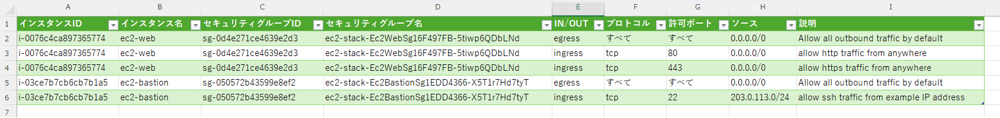

# SteampipeとExcel Power Queryで<br>AWS構成定義書の作成を自動化する

JAWS-UG 東京ランチタイム LT 会 #36

---

# 発表者

- 橋本淳一
- フリーランスのクラウドエンジニア
- 最近都内から栃木に引っ越しました
- 現在の仕事は EC サイトのインフラ運用
- ポートフォリオ: https://lapras.com/public/jhashimoto

---

# 問題: 構成定義書のメンテナンスが辛い

- 構成定義書は継続的なメンテナンスが必要
- 構成変更のたびに手作業で更新しなければならない
- 手作業のため更新漏れや情報の不整合が発生しやすい
- 気づけば定義書が現実と乖離している

実際の AWS 環境と定義書のどちらを信じればいいか、わからなくなる

---

# 解決策: 定義書の作成を自動化する

成果物のイメージ



---

# 解決策: 定義書の作成を自動化する

SteampipeとPower Queryを組み合わせる例。

全体の流れは 3 ステップ。

- Step 1. Steampipe で AWS リソースの構成情報を CSV に出力
- Step 2. Excel Power Query で CSV を読み込んで構成定義書を生成
- Step 3. リソース構成と定義書の同期は CSV を再出力して Excel で更新

Step 1 と Step 2 は定義書の初回作成、Step 3 は定義書の最新化

---

# この手法のメリット

- 構成定義書は「読み取り専用のビュー」なので手動メンテ不要
- 構築手法に依存しない
  - マネコン、CLI、CloudFormation、Terraform、何でも対応
- システムのライフサイクルに依存しない
  - 定義書が存在しない、陳腐化した環境でも即座に定義書を生成可能
- クラウドサービスに依存しない
  - [Steampipeプラグイン](https://hub.steampipe.io/)で AWS / Azure / GCP など多くのサービスに対応

---

# Step 1: 構成情報をCSVで抽出する (1/4)

[Steampipe](https://steampipe.io/) とは

- SQL でクラウドリソースの情報を抽出できるオープンソースツール
- プラグイン方式で各クラウドプロバイダーに対応
- 認証は AWS CLI と同じ仕組みで動作する（環境変数・プロファイルなど）

AWS プラグイン: https://hub.steampipe.io/plugins/turbot/aws

---

# Step 1: 構成情報をCSVで抽出する (2/4)

Steampipe のインストール

https://steampipe.io/downloads?install=linux

```bash
sudo /bin/sh -c "$(curl -fsSL https://steampipe.io/install/steampipe.sh)"

# AWSプラグインのインストール
steampipe plugin install aws
```

---

# Step 1: 構成情報をCSVで抽出する (3/4)

SQL を記述する。

<style>
/* コードブロックのはみ出しを防ぐ */
pre {
  font-size: 0.54em; 
}
</style>

```sql
SELECT
  tags->>'Name' AS "名前",
  instance_id AS "インスタンスID",
  instance_type AS "インスタンスタイプ",
  image_id AS "イメージID",
  private_dns_name AS "プライベートDNS",
  private_ip_address AS "プライベートIP",
  public_dns_name AS "パブリックDNS",
  public_ip_address AS "パブリックIP",
  vpc_id AS "VPC ID",
  subnet_id AS "サブネットID",
  placement_availability_zone AS "アベイラビリティゾーン",
  root_device_name AS "ルートデバイス名",
  key_name AS "キーペア",
  platform_details AS "プラットフォーム",
  architecture AS "アーキテクチャ"
FROM aws_ec2_instance
-- 終了したインスタンスは除外
WHERE NOT instance_state = 'terminated'
ORDER BY "名前";
```

[aws_ec2_instance table リファレンス](https://hub.steampipe.io/plugins/turbot/aws/tables/aws_ec2_instance)

---

# Step 1: 構成情報をCSVで抽出する (4/4)

クエリを実行して CSV に出力する。

```bash
steampipe query --output csv ec2.sql > ec2.csv
```

出力例:

```
名前,インスタンスID,インスタンスタイプ,イメージID,プライベートDNS,プライベートIP,パブリックDNS,パブリックIP,VPC ID,サブネットID,アベイラビリティゾーン,ルートデバイス名,キーペア,プラットフォーム,アーキテクチャ
ec2-bastion,i-0e81f7e63504abda6,t2.micro,ami-0d71b1617df761282,ip-172-16-0-148.ap-northeast-1.compute.internal,172.16.0.148,,,vpc-0b62c113836129ebd,subnet-071b09fbb23cea409,ap-northeast-1a,/dev/xvda,,Linux/UNIX,x86_64
ec2-web,i-0f586042c6e12ace3,t2.micro,ami-0d71b1617df761282,ip-172-16-2-215.ap-northeast-1.compute.internal,172.16.2.215,,,vpc-0b62c113836129ebd,subnet-0c14a31632dc31f61,ap-northeast-1a,/dev/xvda,,Linux/UNIX,x86_64
```

---

# Step 2: CSVをExcelシートに読み込む (1/2)

Power Query とは

- Excel に組み込まれたデータ取得・変換ツール
- さまざまなデータソースから情報を取り込み、整形できる

---

# Step 2: CSVをExcelシートに読み込む (2/2)

1. Excel の[データ]タブを開く
2. [データの取得]→[テキストまたは CSV から]で CSV を選択
3. [データの変換]をクリック
4. Power Query エディターで[1 行目をヘッダーとして使用]をクリック
5. [閉じて読み込む]でシートにインポート

CSV の内容をもとに Excel テーブル（構成定義書）が完成する。

---

# Step 3: 構成変更を定義書に反映する

システムに変更があったら

1. Steampipe でもう一度クエリを実行して CSV に出力する
2. Excel のテーブルを右クリック →[更新]

定義書が最新の構成情報に自動的に同期される。
一度定義書を作成すれば、以降はクエリ実行と Excel の操作だけで済む。

---

# デモ

EC2 インスタンス/セキュリティグループテーブル →「インスタンスの通信許可」定義書

---

# 他にもさまざまな定義書を生成できる

SQL の JOIN を変えるだけで、関心事に応じた定義書を作成できる。

| 定義書 | 使うテーブル |
|---|---|
| インスタンスの通信許可 | `aws_ec2_instance` × `aws_vpc_security_group_rule` |
| インスタンスとストレージ | `aws_ec2_instance` × `aws_ebs_volume` |
| IAMロールの権限 | `aws_iam_role` × `aws_iam_policy` |

---

# デメリット (1/2)

- 柔軟なフォーマットでは出力できない
  - Excel のテーブル形式で出力されるため、自由なレイアウトの定義書は作れない
  - 帳票形式の定義書を作る場合は、別の方法を模索した方が良い
- テーブルのリファレンスを見ながら SQL を書くのが面倒
  - クエリ例は公式ドキュメントに多数掲載されているので参考にすると良い
    - https://hub.steampipe.io/plugins/turbot/aws/queries
  - Steampipe 公式の MCP サーバーがあり、自然言語でクエリできる（未検証）
    - https://steampipe.io/blog/steampipe-mcp

---

# デメリット (2/2)

- CIパイプラインへの導入は限定的
  - Step 1 は CI に組み込むことは可能
  - Power Query はサーバー上では利用できないため、Step 2 は CI には組み込みにくい
    - PowerShell によるデスクトップでの自動化は可能
    - https://www.cloudbuilders.jp/articles/4242/

---

# まとめ

- Steampipe で AWS リソースの構成情報を CSV として抽出できる
- Excel Power Query で CSV を読み込んで構成定義書を生成
- CSV を上書き → Excel で「更新」するだけで常に最新状態を維持
- 構築手法、システムのライフサイクル、クラウドサービスに依存しない汎用的な手法

手動メンテナンスの負荷を大幅に削減し、信頼性の高い構成定義書を実現できる。

---

# ありがとうございました

元記事: https://zenn.dev/jhashimoto/articles/steampipe-powerquery-aws-configdoc
